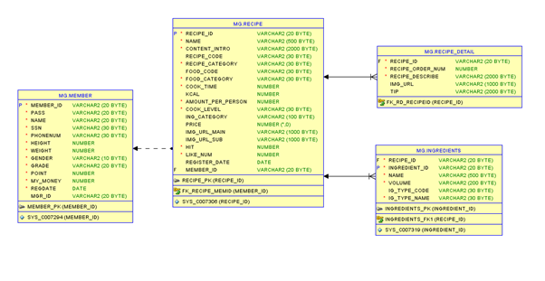

# MyFridge

 매끼니, 세끼를 챙겨주는 냉장고 관리 겸 레시피 조회 웹사이트

**팀 별 IoT 운영시스템 구축 미니프로젝트 주제 설정**

1인 가구가 증가하고 잦은 외식문화로 인해 냉장고 속의 식재료를 관리하기가 힘들어졌다. 그래서 냉장고 속 식재료를 관리해주고 그와 관련된 레시피를 추천해주는 사이트를 제작하기로 결정했다.

# 매끼세끼

### 1. 내가 기여한 파트

1.  **메인 페이지 테마별 레시피 조회** ( 조회수별, 숙취 , 피로에 좋은 음식)

2.  **레시피 리스트 조회** ( 전체조회 / 검색어 / 종류별)

3.  **레시피 세부 사항 조회** ( 이름, 재료, 과정, 이미지 등등..)

*  Session여부에 따라 좋아요, 조회수 활성화

4. **레시피 등록** 

* 기본 세부사항, 재료, 레시피 제작 과정 추가 가능

5. **모든 페이지 디자인(CSS) 기여**

### 2. Database 설계

* 전체 테이블 구조


* 내가 개발한 Part

  

### 3. 시스템 구축

*  시스템 구조 및 아키텍쳐 설계


* Maven 기반의 spring framework


* 사용된 라이브러리


* **Recipe- tiles** 구성

  메인 tiles를 하나 정의한 뒤 모든 페이지에 동일한 TOP과 BOTTOM이 노출될 수 있도록 설계.

  팀원들이 각자 구현하고자 하는 View에 따라 Content만 교체하는 방식으로 작업.

   


* 내가 사용한 **recipe mapper** 


* ### Mybatis

기능에 필요한 VO객체를 직접 정의한 뒤, alias로 명칭을 부여하여 해당 객체 타입을 리턴할 때 alias를 통해 접근할 수 있도록 설계

mapper 패키지 안에 sql문이 실행될 수 있도록 작성한 xml파일을 찾을 수 있도록 작성

### 4. 페이지 구성

#### 1. 메인 페이지

* **가장 Hot한 요리**

가장 HOT한 요리로 조회수에 따라 레시피를 조회하기 위한 SELECT문을 구성했다. 조회수가 가장 높은 3가지 레시피를 보여주며, 부가적으로 회원들의 좋아요 수까지 보여 준다.

```sql
select * from(select * from recipe)order by hit desc;
```


* **테마별 레시피** 
  *  숙취에 가장 좋은 비타민 B 가 가장 많이 들어있는 재료를 기준으로 레시피를 추천해준다.
  *  피로에 좋은 스테미나, 비타민 B가 많이 들어있는 재료가 들어있는 레시피 추천


#### 2. 레시피 조회

l 숙취에 가장 좋은 비타민 B 가 가장 많이 들어있는 재료를 기준으로 레시피를 추천해준다.

피로에 좋은 스테미나, 비타민 B가 많이 들어있는 재료가 들어있는 레시피 추천                                                    


* **레시피 CLRUD**

  * 조회 결과가 dbms_random()으로 정렬됨 

* `Pagenum`과 `contentnum`에 따른 **페이징 처리**

  *  총 게시물 수를 그 페이지 속에 보여줄 게시물의 수로 나누어 나온 값을 기준으로 페이지 값을 정하고 그것을 **GET방식**으로 넘겨준다. 그렇기 때문에 당장 필요한 페이지만 메모리에 적재하기 때문에 메모리 사용량이 감소하여 페이지를 여는 시간을 감소시킬 수 있었다.
  *  ajax와 DB를 연동하여 ‘카테고리’ 와 ‘검색어’ 에 따른 리스트를 불러올 수 있도록 제작했다.
  *  **레시피 전체 조회**

  ```SQL
  SELECT recipe_id,name,register_date,member_id,img_url_main 
  	from(select recipe_id,name,register_date,member_id,img_url_main,ROW_NUMBER() OVER 			(ORDER BY recipe_id)r from recipe)
      where r between #{pagenum} and #{contentnum} 
  ```

  * **레시피 제목으로 검색(조회)**
    * Text창에 제목 입력 후 검색 버튼 클릭시 레시피 조회 가능

  ```SQL
  SELECT recipe_id,name,register_date,member_id,img_url_main,recipe_category ,r 
  	from (select recipe_id,name,register_date,member_id,img_url_main,recipe_category,
            ROW_NUMBER() OVER (ORDER BY recipe_id) r 
            from recipe where name like '%' || #{search} || '%')
      where r between #{pagenum} and #{contentnum} 
  ```

  * **레시피 카테고리 조회**
    * 한식 , 서양 이탈리아, 퓨전 등등의 radio 버튼을 클릭 시의 레시피 조회

  ```sql
  SELECT recipe_id,name,register_date,member_id,img_url_main,recipe_category ,r
  	from (select recipe_id,name,register_date,member_id,img_url_main,recipe_category,
            ROW_NUMBER() OVER (ORDER BY recipe_id) r 
            from recipe where recipe_category like '%' || #{recipe_category} || '%')
      where r between #{pagenum} and #{contentnum} 
  ```

  * 이렇듯 게시물 전체 조회는 `ModelAndView`로 넘겨주고 검색 기능인 `ajax`는 recipeDTO와 PageDTO를 갖고 있는 DTO를 따로 만들어 제작했다.


#### 3. 레시피 등록


* 여기까지는 레시피의 기본적인 등록 페이지다

  


* 재료 종류 라디오 버튼 (주재료/부재료/양념) 클릭 후 , plus 버튼 클릭 시 `ajax`를 이용해 그에 따른 재료 추가 노드가 뜨게 했다. 한 번의 Insert에 다수의 재료가 들어가기 때문에 재료 VO와 레시피과정VO를 기본 레시피 VO에 담아서 배열로 넣어준다. 

② 레시피 마다 다를 수 있기 때문에 동적으로 요리 순서를 추가할 수 있도록 제작했다. 그래서for문을 돌려 속성 name의 배열 index 값이 1씩 증가하도록 제작했다.

```java
	function add_content(){
		count++;
		recipeContent = document.createTextNode("step"+(count+1));
		newP = document.createElement("p");
		newInput = document.createElement("input");
		newInput.setAttribute("name", "recipe_detail[" + count + "].recipe_order_num");
		newInput.setAttribute("value", count+1);
		newInput.setAttribute("style", "display:none;");
		newP.appendChild(recipeContent);
		newdiv = document.getElementById("content");
		newdiv.appendChild(newP);
		newdiv.appendChild(newInput);
		newcontent = document.querySelector("#ControlTextarea").cloneNode(true);
		newcontent.setAttribute( "name", "recipe_detail["+count+"].recipe_describe"); 
		newdiv.appendChild(newcontent);
		
	}
```


③ 레시피에 따라 최소 한 개부터 여러 개의 이미지 파일 업로드가 가능하다. 파일 업로드하는 라이브러리를 따로 추가 시켰고, 파일 업로드 시 저장되는 fileUpload 폴더를 따로 만들었다. 

#### 4. 레시피 상세조회

* 해당 레시피의 이미지 클릭 시 레시피 조회가 가능하도록 만들었다


③ **좋아요 수** : 로그인 `session` 기능을 통해 로그인을 하지 않은 상태일 시 ,좋아요 버튼 비활성화가 되어 로그인이 필요하다는 alert창이 뜬다.

```sql
update recipeset like_num = like_num+1where recipe_id=#{recipe_id} 
```

로그인 시 활성화가 되어 클릭을 하면 ① ♥ 숫자가 +1 이 된다.

② **조회수** : update 문을 이용해서 레시피를 조회할 때마다 +1씩 증가한다.

```sql
update recipeset hit = hit +1where recipe_id=#{recipe_id}
```


* 레시피에 맞는 요리 과정 순서를 제공한다.

* 조리 과정의 이미지는 만약 작성자가 올리지 않았을 때는 [과정 이미지 생략 ] 이라는 문구가 뜨며, 

  해당 과정의 요리 tip을 제공해 준다.


### 5. 최종 PPT


